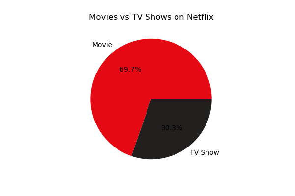
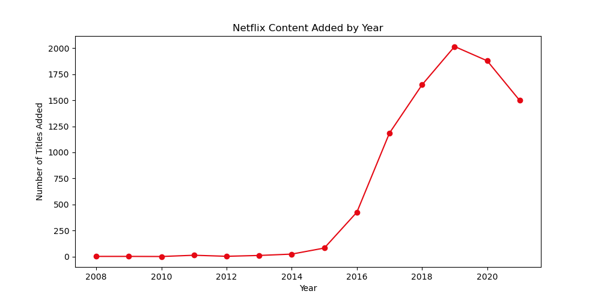
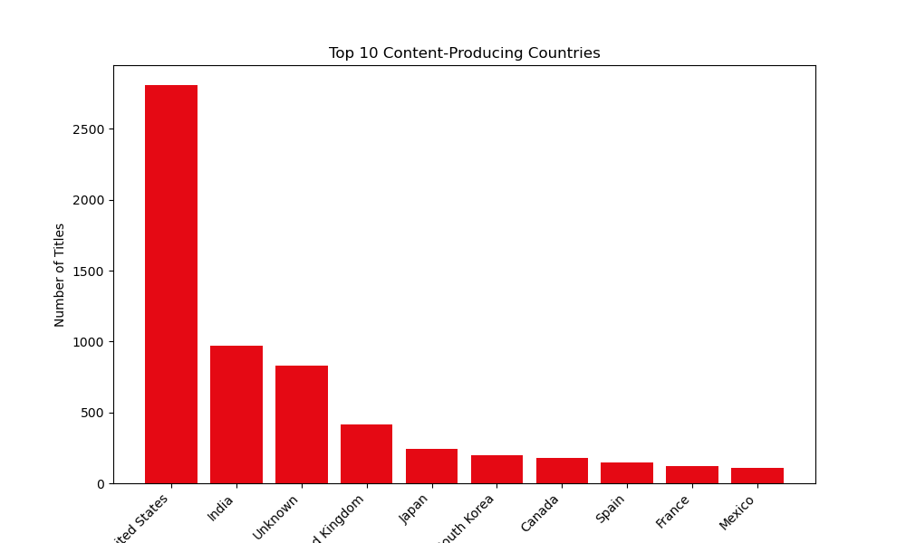
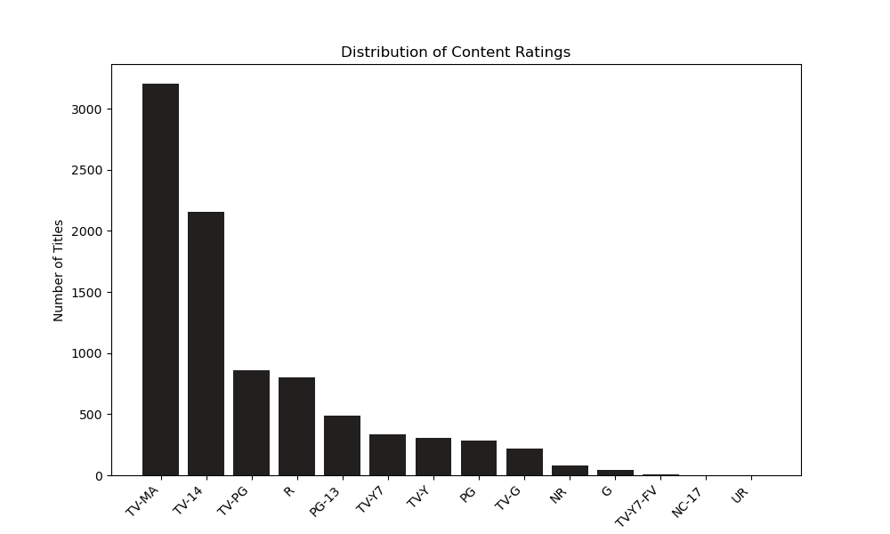
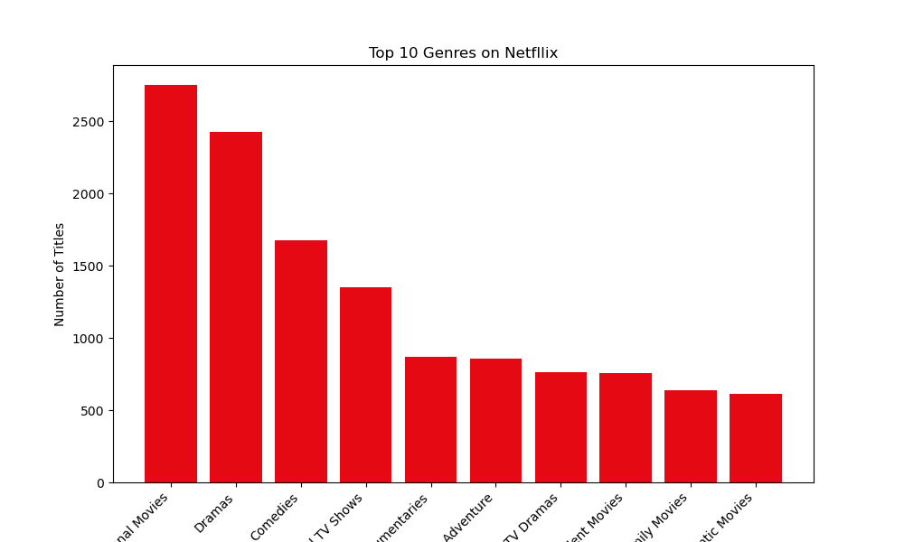
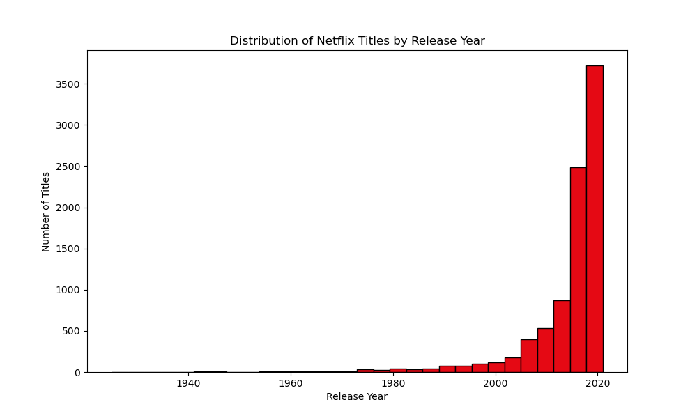
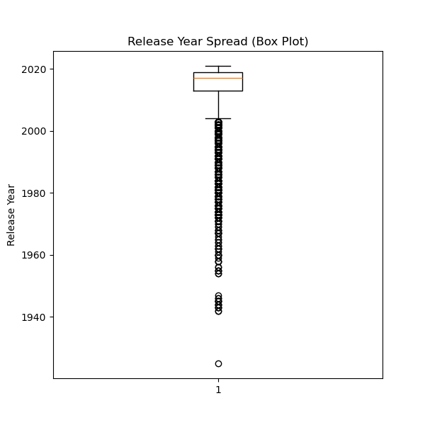

# Week 1 — Data Cleaning & Exploratory Data Analysis

**Dataset:** Netflix Movies & TV Shows
**Source:** [Kaggle — Netflix Shows](https://www.kaggle.com/datasets/shivamb/netflix-shows)
**Size:** 8,807 rows × 12 columns
**Tools:** Python, Pandas, Matplotlib

---

## 🎯 Objective

Clean, validate, and explore the raw Netflix dataset — transforming messy, real-world data into a structured, analysis-ready form, then uncovering key patterns through exploratory analysis.

## 📊 Dataset Understanding

- 1 numerical column (`release_year`), 11 categorical/text columns
- `show_id` confirmed as the unique identifier (8,807 unique values, matching row count)
- Columns cover title metadata, cast/crew, country, ratings, and content categorization

## 🧹 Cleaning Summary

| Issue Found | Action Taken |
|---|---|
| Missing values (`director`, `cast`, `country`) | Filled with `"Unknown"` to preserve data volume rather than dropping ~30% of rows |
| Missing values (`date_added`, `rating`, `duration`) | Rows dropped (13 total — too few to impute reliably) |
| Duplicate rows | None found |
| Inconsistent date formats in `date_added` | Mixed formats (e.g. `25-Sep-21` vs `December 23, 2018`) plus leading whitespace — standardized using pandas' mixed-format datetime parsing |
| Column names | Already standardized (lowercase, underscore-separated) — no changes needed |
| Text casing (`type`, `rating`) | Checked — no inconsistencies found |
| Shifted/misaligned data | Checked (e.g. duration values leaking into rating column) — none found |

## 🔍 Key EDA Findings

- **Movies dominate the catalog:** 6,126 movies (70%) vs. 2,664 TV shows (30%)
- **Explosive content growth 2016–2019:** additions jumped from 82 titles (2015) to a peak of 2,016 (2019), dipping slightly in 2020–2021
- **United States leads content origin** (2,809 titles), followed by India (972) and the United Kingdom (418)
- **TV-MA is the most common rating** (3,205), indicating a catalog skewed toward mature audiences
- **"International Movies" and "Dramas"** are the top genres (2,752 and 2,426 respectively)

## 📈 Visualizations



### Content Added by Year


Content additions grew sharply from 2016 onward, peaking at 2,016 titles in 2019, then dipping slightly in 2020–2021 — likely reflecting pandemic-related production slowdowns.

### Top 10 Content-Producing Countries


The United States leads by a wide margin (2,809 titles), followed by India (972) and the United Kingdom (418).

### Content Ratings Distribution


TV-MA is the most common rating (3,205), indicating a catalog skewed toward mature audiences.

### Top 10 Genres


"International Movies" (2,752) and "Dramas" (2,426) are the top genres, reflecting a globally-flavored catalog.

### Release Year Distribution


The distribution is heavily right-skewed — most titles were released after 2010, with very few before 1980.

### Release Year Spread


The median release year sits close to 2017–2018. Titles released before ~1970 appear as scattered outliers, confirming older content makes up a very small share of the catalog.

## 💡 Top Insights

1. **Netflix's catalog is movie-dominated**, suggesting historical prioritization of film licensing over series production.
2. **Explosive content growth (2016–2019)** aligns with Netflix's known global expansion period; the 2020–2021 dip likely reflects pandemic-related production slowdowns.
3. **Despite U.S. dominance in country of origin**, genre data shows the catalog is substantively international in content style, not just sourcing.
4. **The mature-audience skew (TV-MA, R)** suggests Netflix's content strategy targets adult viewers more heavily than family audiences.

## 📁 Files in This Folder

- `Netflix.ipynb` — full notebook (dataset understanding, cleaning, EDA, visualizations, insights)
- `netflix_titles.csv` — raw dataset
- `netflix_cleaned.csv` — cleaned, analysis-ready dataset
- `visuals/` — all chart images referenced above

## ▶️ How to Run

```bash
pip install pandas matplotlib seaborn
jupyter notebook Netflix.ipynb
```

Run all cells top to bottom.
