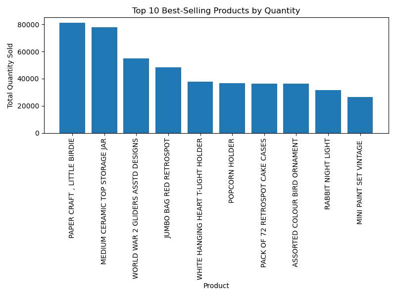
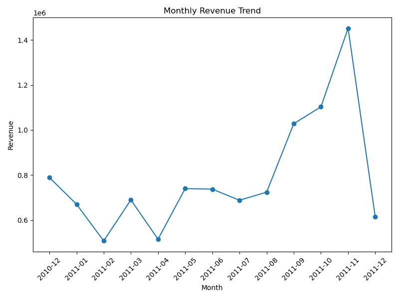
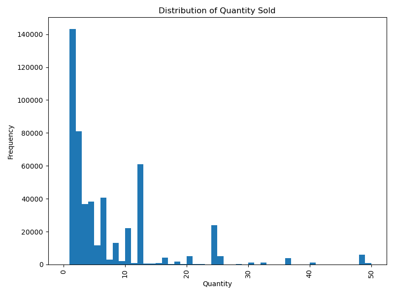
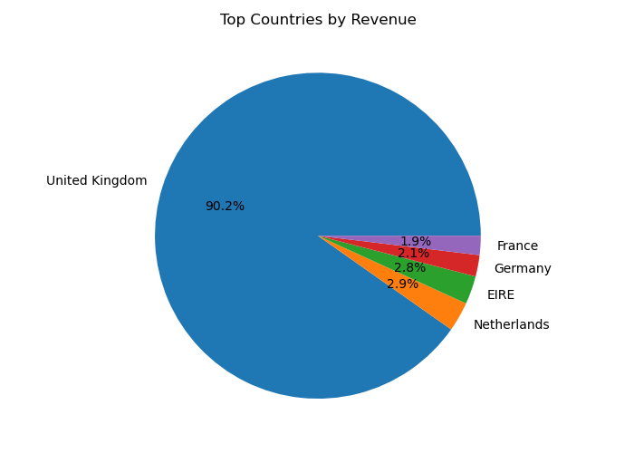
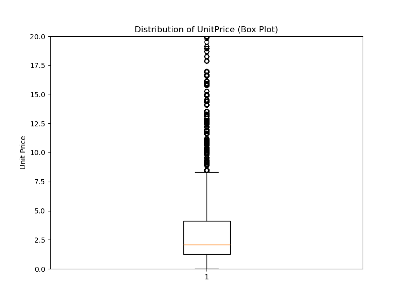
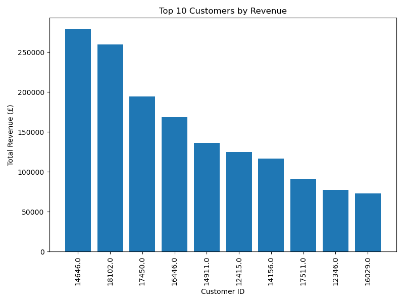

# Week 2: Online Retail (E-commerce) Dataset — Data Cleaning & EDA

**Dataset:** Online Retail Dataset
**Source:** [Kaggle — vijayuv/onlineretail](https://www.kaggle.com/datasets/vijayuv/onlineretail)
**Size:** 541,909 rows × 8 columns (raw)
**Tools Used:** Python, Pandas, Matplotlib, Jupyter Notebook

---

## 🎯 Objective

Clean and validate a real-world transactional e-commerce dataset, then explore it to uncover patterns in sales, revenue, and customer purchasing behavior — transforming messy raw data into a structured, analysis-ready format.

---

## 📊 Dataset Understanding

| Column | Type | Description |
|---|---|---|
| InvoiceNo | Categorical (object) | Order/invoice identifier; prefixed "C" for cancellations |
| StockCode | Categorical (object) | Product code (includes non-product codes, see below) |
| Description | Categorical (object) | Product name |
| Quantity | Numerical (int) | Units per line item |
| InvoiceDate | Datetime | Date/time of transaction |
| UnitPrice | Numerical (float) | Price per unit (£) |
| CustomerID | Numerical (float) | Unique customer identifier |
| Country | Categorical (object) | Customer's country |

**Unique identifier:** No natural primary key exists in the raw data. Neither `InvoiceNo` alone nor the combination `InvoiceNo + StockCode` reliably identifies a unique row — the same product can legitimately appear more than once on the same invoice at different quantities. A **surrogate key** was created using `df.reset_index()`.

Each row represents a single product line item within a customer order (not a whole order).

---

## 🧹 Cleaning Summary

| Issue Found | Action Taken |
|---|---|
| Missing `Description` (1,454 rows) | Filled via lookup of matching `StockCode` from other rows; 112 unresolvable rows filled as "Unknown" |
| Missing `CustomerID` (135,037 rows, ~25%) | Left as-is; excluded only when performing customer-specific analysis, to avoid discarding otherwise usable rows or fabricating IDs |
| Exact duplicate rows (5,268) | Identified via `df.duplicated()` and removed |
| No natural primary key | Surrogate key created via index reset |
| Negative `Quantity` values | Confirmed as legitimate order cancellations (InvoiceNo prefixed "C"); retained and flagged as returns |
| Negative `UnitPrice` values (2 rows) | Isolated to StockCode "B" ("Adjust bad debt") — an accounting entry, not a product sale; excluded from revenue/product analysis |
| Non-product StockCodes (POST, D, C2, DOT, M, S, PADS, B, CRUK) | Identified as postage, discounts, carriage, manual entries, samples, and charity donations; excluded from product-level analysis via a separate `df_products` dataframe |
| `InvoiceDate` stored as text | Converted to proper datetime format |
| Inconsistent `Description` whitespace | Stripped leading/trailing spaces |
| "Unspecified" `Country` values (442 rows) | Standardized to null, consistent with other missing data |
| Column names | Already clean and consistent — no changes needed |

---

## 🔍 Key EDA Findings

- **Top-selling product by volume:** "PAPER CRAFT, LITTLE BIRDIE" leads with 80,995 units sold (returns excluded).
- **Revenue is heavily UK-concentrated:** The United Kingdom generates ~£8.74M in revenue — 90.2% of the total — with the Netherlands and EIRE a distant second and third.
- **Volume and revenue leaders differ:** "REGENCY CAKESTAND 3 TIER" generates the most revenue (£174,157) despite not ranking in the top 10 by quantity sold, indicating a lower-volume, higher-value product.
- **Sales peak in November:** Monthly revenue trends upward through the year, peaking at £1,452,146 in November 2011, consistent with holiday-season demand. The apparent December drop reflects incomplete data (dataset ends 9 December 2011), not an actual decline.
- **Customer base is top-heavy:** The highest-value customer generated £279,138 in revenue. Across all customers, the average is 4.25 distinct orders (median: 2), with a maximum of 206 — pointing to a small base of loyal repeat buyers alongside many one-time purchasers.

---

## 📈 Visualizations


Bar chart of the 10 best-selling products by quantity (returns excluded). "PAPER CRAFT, LITTLE BIRDIE" leads, followed by "MEDIUM CERAMIC TOP STORAGE JAR" and "WORLD WAR 2 GLIDERS ASSTD DESIGNS."


Line chart of revenue by month. Revenue trends upward through the year, peaking in November 2011; the December drop reflects incomplete data rather than a real decline.


Histogram of quantity sold, zoomed to 0–50 units. Purchases are heavily skewed toward small quantities, with secondary spikes at common bulk sizes (10, 12, 24).


Pie chart of revenue share by country. The UK accounts for 90.2% of total revenue, confirming a domestic-focused customer base.


Box plot of unit price, capped at £20 for readability. The median price is ~£2, with the middle 50% of items priced between £1.25 and £4.13; many higher-priced items are flagged as statistical outliers but represent legitimate products.


Bar chart of the top 10 customers by total revenue. The leading customer contributed £279,138 — significantly ahead of the rest of the top 10.

---

## 💡 Top Insights

1. **The business is overwhelmingly UK-domestic.** 90.2% of revenue comes from the UK, with every other country contributing under 3% (see *Top Countries by Revenue Share*).
2. **Sales volume and revenue leadership come from different products.** The top-selling item by units isn't even in the top 10 by revenue, showing that pricing strategy and inventory planning need to weigh both metrics separately (see *Top 10 Best-Selling Products*).
3. **Most purchases are small and habitual.** The typical order line is just 1–3 units, with predictable spikes at bulk-buy quantities like 10, 12, and 24 (see *Distribution of Quantity Sold*).
4. **Demand builds toward a November peak**, consistent with holiday shopping — useful for stock and staffing planning ahead of the season (see *Monthly Revenue Trend*).
5. **Revenue is concentrated among a small number of high-value, repeat customers**, while most customers purchase only once or twice — a strong candidate for a targeted retention strategy (see *Top 10 Customers by Revenue*).

---

## 📁 Files in This Folder

```
Week-02-Data-Cleaning-EDA/
├── README.md
├── Ecommerce.ipynb
├── online_retail.csv          # raw dataset
├── ecommerce_cleaned.csv      # cleaned dataset
└── visuals/
    ├── top_products_bar.png
    ├── monthly_revenue_line.png
    ├── quantity_histogram.png
    ├── countries_pie.png
    ├── unitprice_boxplot.png
    └── top_customers_bar.png
```

---

## ▶️ How to Run

```bash
pip install pandas matplotlib jupyter
jupyter notebook Ecommerce.ipynb
```

Run all cells in order — cleaning steps must execute before the EDA and visualization sections, since later cells depend on the cleaned `df_products` / `df_sales` dataframes created earlier in the notebook.
