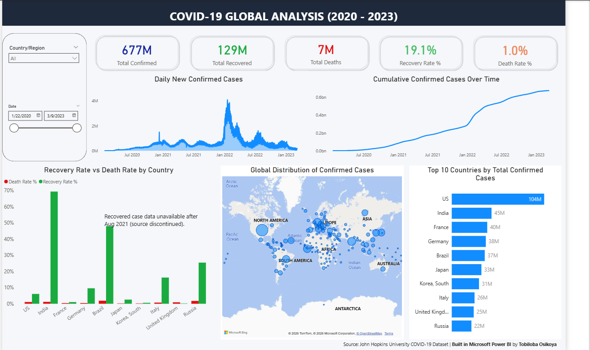
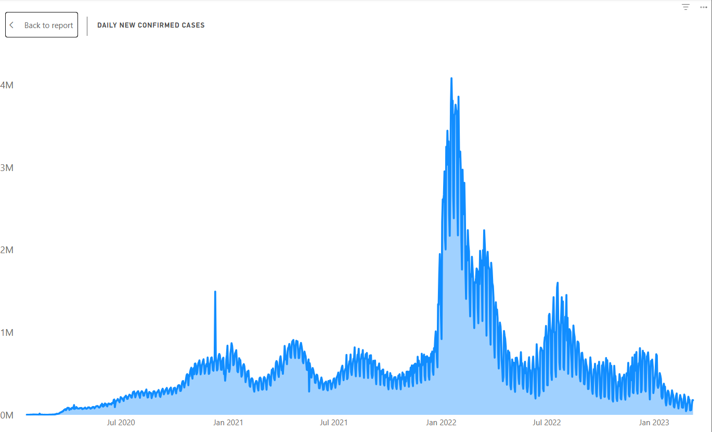
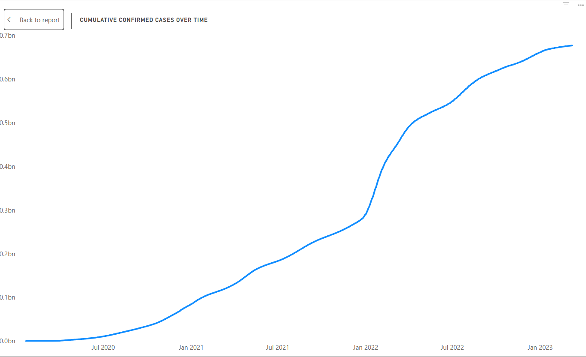
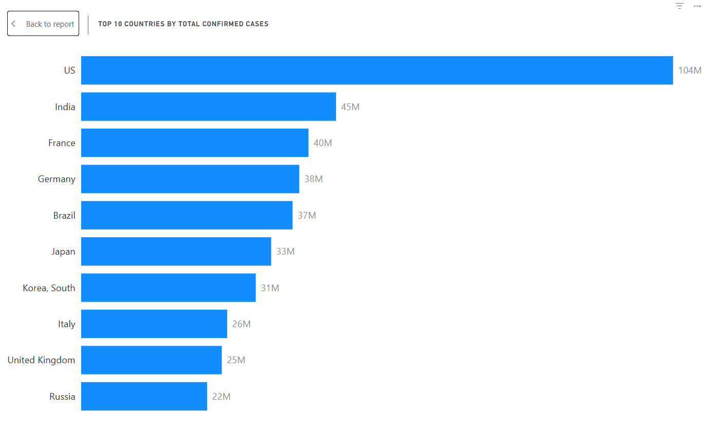
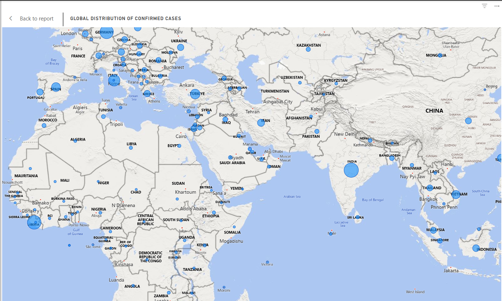
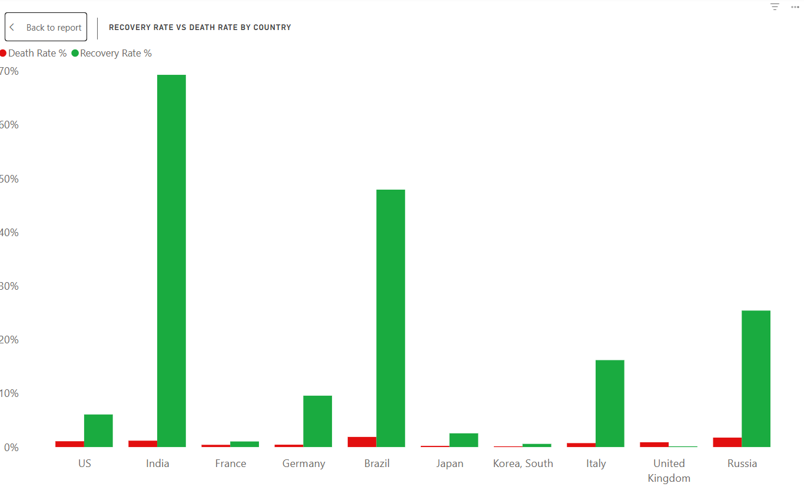

# 🦠 COVID-19 Global Time-Series Analysis — Week 4

**Dataset:** CSSE COVID-19 Time-Series Data (Johns Hopkins University)
**Source:** https://github.com/CSSEGISandData/COVID-19
**Size:** ~330,000 rows × 8 columns (after unpivot + merge — 3 source files, ~290 location rows × ~1,145 dates each)
**Tools Used:** Power BI (Power Query, DAX), Power BI Desktop

---

## 🎯 Objective

Clean, merge, and model three separate COVID-19 time-series files (Confirmed, Deaths, Recovered) into a single analysis-ready table, then build an interactive dashboard surfacing global spread patterns, country-level outcomes, and key pandemic waves.

---

## 📊 Dataset Understanding

| Column | Type | Notes |
|---|---|---|
| `Province/State` | Text | Sparse — many countries report at country level only |
| `Country/Region` | Text | Primary grouping dimension |
| `Lat` | Decimal | Used for map plotting |
| `Long` | Decimal | Used for map plotting |
| `Date` | Date | Originally wide-format column headers; unpivoted to rows |
| `Confirmed` | Whole number | Cumulative count |
| `Deaths` | Whole number | Cumulative count |
| `Recovered` | Whole number | Cumulative count; source discontinued Aug 2021 |

**Unique identifier confirmed:** `Country/Region` + `Province/State` + `Date` together uniquely identify each row. No single column is unique on its own — `Country/Region` alone repeats once per date, and `Date` alone repeats once per country.

---

## 🧹 Cleaning Summary

| Issue Found | Action Taken |
|---|---|
| Data in wide format (one column per date) | Unpivoted all three files in Power Query, converting date columns into `Date`/`Value` row pairs |
| `Date` loaded as text after unpivot | Explicitly set `Date` column to Date type in all three queries before merging |
| Merge returned all nulls on first attempt | Diagnosed as a date-type mismatch between queries; fixed by standardizing type across all three before merging |
| Merge still returned nulls after date fix | Found join column order wasn't matching positionally between queries (Power Query matches merge keys by position, not name) — corrected column order to match exactly |
| Total Confirmed/Deaths/Recovered showing inflated values (100x+ too high) | Original measures used plain `SUM()` on a cumulative column, adding every date's running total together; rebuilt as point-in-time measures using `LASTDATE`/last-valid-date logic |
| Total Recovered returning 0 | Root cause: Recovered dataset stops updating Aug 2021, so the table's last overall date has no recovered value; rebuilt measure to find the last date with a non-zero Recovered value instead of the absolute last date |
| No standalone date dimension | Built a dedicated `DateTable` using `CALENDAR()`, marked as the official Date table, and related it to the merged fact table |
| Duplicate/inconsistent country naming risk | Checked for and trimmed whitespace on `Country/Region` before merging |

---

## 🔍 Key EDA Findings

- The **US** recorded the highest total confirmed cases at **104M**, more than double **India's 45M**, despite India's significantly larger population
- Global daily new cases peaked sharply in **January 2022** (Omicron wave), reaching roughly **4M new cases/day at the peak** — by far the largest spike across the entire 2020–2023 timeline
- **Recovery Rate %** varies enormously by country (India ~70%, US near 0%) — driven largely by inconsistent reporting and the Recovered dataset's discontinuation in August 2021, not genuine differences in outcomes
- **Death Rate %** was notably lower in the **UK, France, Japan, and South Korea** compared to **Brazil, Russia, and India**
- The top 10 countries by total confirmed cases (US, India, France, Germany, Brazil, Japan, South Korea, Italy, UK, Russia) account for the overwhelming majority of global case volume relative to the remaining 180+ countries in the dataset

---

## 📈 Visualizations


Full COVID-19 dashboard view — KPI cards, daily/cumulative case trends, country comparison, map, and recovery vs. death rate chart in one page.


Daily new confirmed cases globally, showing distinct pandemic waves — most notably the sharp Omicron-driven spike in January 2022.


Cumulative global confirmed cases over time, climbing from near-zero in early 2020 to roughly 677M by March 2023, with visibly steeper growth during major waves.


The US leads all countries in total confirmed cases, followed by India and France, highlighting how case volume didn't scale directly with population size.


Geographic spread of confirmed cases by country, sized by total case volume — concentration is visible across North America, Europe, and South Asia.


Comparison of recovery and death rates across the top 10 countries by case volume; recovery rate differences are heavily influenced by the Recovered dataset's August 2021 discontinuation.

---

## 💡 Top Insights

1. **Case volume didn't track population size** — the US's 104M confirmed cases far outpaced more populous India (45M), suggesting factors beyond population density drove transmission differences *(see Top 10 Countries chart)*
2. **Omicron was the dominant wave** — the January 2022 spike in daily new cases dwarfs every prior wave in the dataset, making it the single most significant event in the pandemic's trajectory *(see Daily New Cases chart)*
3. **Recovery Rate % is not a reliable cross-country metric post-2021** — because the source data stopped tracking recoveries in August 2021, any dashboard or report using this metric should explicitly caveat that limitation *(see Recovery vs Death Rate chart)*
4. **Death Rate % differences may reflect healthcare capacity** — lower death rates in the UK, France, Japan, and South Korea versus Brazil, Russia, and India could point to differences in healthcare infrastructure or reporting standards rather than virus behavior alone *(see Recovery vs Death Rate chart)*
5. **A small group of countries drove most global case volume** — the top 10 countries by confirmed cases represent a disproportionate share of the global total, useful for prioritizing where deeper country-level analysis adds the most value *(see Global Distribution Map)*

---

## 📁 Files in This Folder

```
Week4_COVID19_Dashboard/
├── COVID19_Dashboard.pbix
├── time_series_covid19_confirmed_global.csv
├── time_series_covid19_deaths_global.csv
├── time_series_covid19_recovered_global.csv
├── screenshots/
│   ├── dashboard_overview.png
│   ├── daily_new_cases.png
│   ├── cumulative_confirmed.png
│   ├── top10_countries.png
│   ├── global_map.png
│   └── recovery_vs_death_rate.png
├── COVID19_Presentation.pptx
└── README.md
```

---

## ▶️ How to Run

1. Install [Power BI Desktop](https://powerbi.microsoft.com/desktop/) (Windows only)
2. Open `COVID19_Dashboard.pbix`
3. If prompted, click **Refresh** on the Home ribbon to reload the source CSVs
4. Use the **Date** and **Country/Region** slicers on the left panel to filter the dashboard interactively
