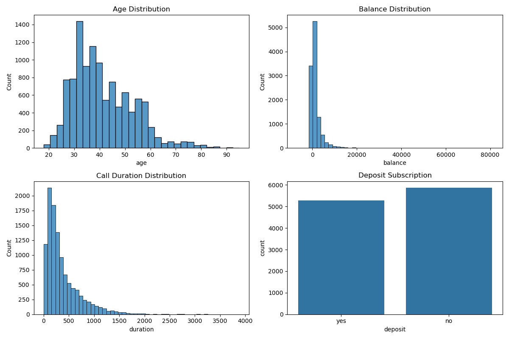
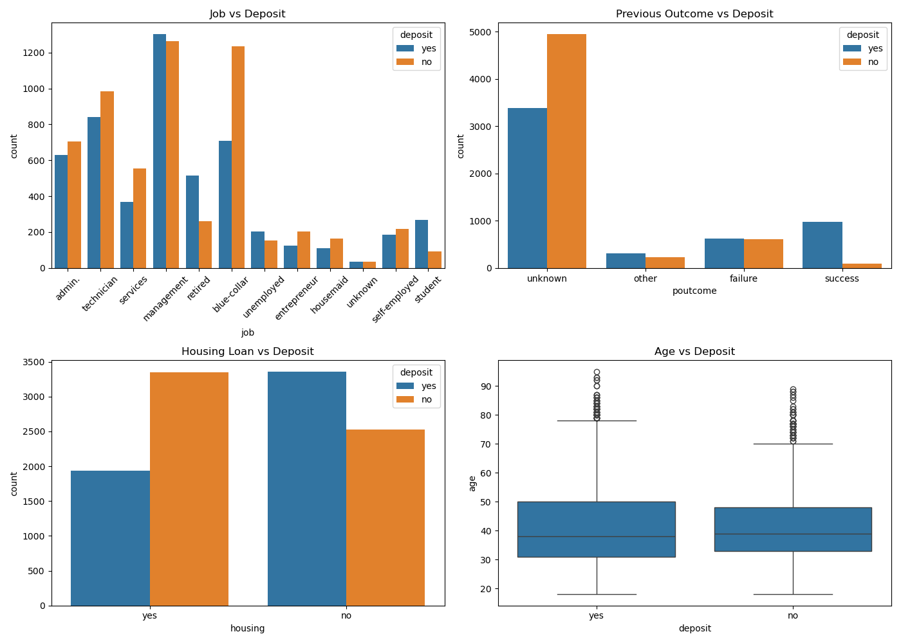
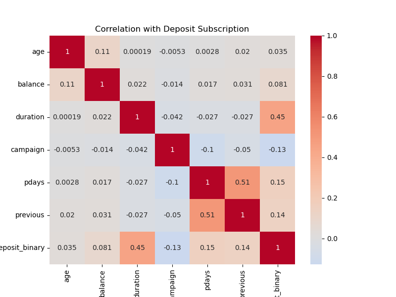
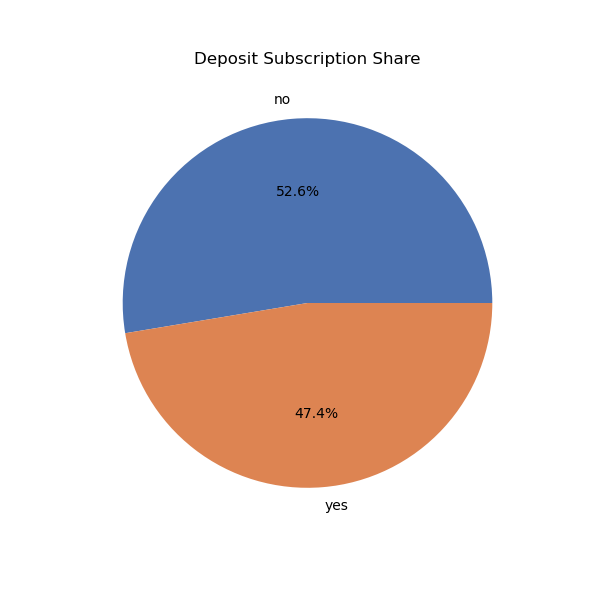
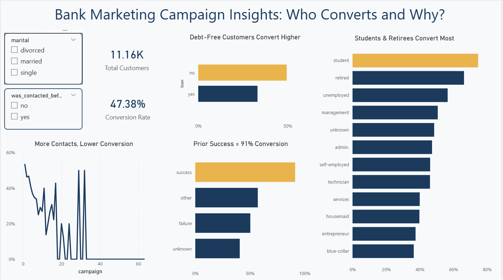

# 🏦 Bank Marketing Campaign Analysis — Week 5

**Dataset:** Bank Marketing Dataset (Term Deposit Subscription Campaigns)
**Source:** https://www.kaggle.com/datasets/janiobachmann/bank-marketing-dataset
**Size:** 11,162 rows × 17 columns
**Tools Used:** Python (pandas, matplotlib, seaborn), Power BI, PowerPoint

---

## 🎯 Objective

Identify which customer characteristics and campaign approaches are most associated with term deposit subscription, so marketing can prioritize outreach, reduce wasted contact effort, and improve overall campaign efficiency.

---

## 📊 Dataset Understanding

| Column Type | Columns |
|---|---|
| Numeric (int64) | age, balance, day, duration, campaign, pdays, previous |
| Categorical (object) | job, marital, education, default, housing, loan, contact, month, poutcome, deposit (target) |

**Unique identifier confirmed:** The dataset has no explicit customer ID column; `df.duplicated().sum()` returned 0, confirming each of the 11,162 rows represents a unique customer record.

---

## 🧹 Cleaning Summary

| Issue Found | Action Taken |
|---|---|
| Missing values check | `df.isnull().sum()` returned 0 nulls across all 17 columns — no traditional missing data |
| Duplicate rows | `df.duplicated().sum()` = 0 — no duplicates found |
| Hidden missing values (`"unknown"` in job, education, contact, poutcome) | Kept as its own category rather than imputed, since it likely reflects gaps in data collection rather than a real value |
| Placeholder value in `pdays` (`-1` = never contacted before) | Engineered a new `was_contacted_before` (yes/no) flag for cleaner filtering in Power BI, instead of treating -1 as a real day count |
| Target variable encoding | Created `deposit_binary` (1/0) alongside the original `deposit` (yes/no) for correlation analysis and Power BI measures |
| Extreme outliers in `balance` and `duration` | Flagged via `describe()` and boxplots (balance ranges from -6,847 to 81,204); not removed, but noted since they pull the mean well above the median |

---

## 🔍 Key EDA Findings

- The target variable is nearly balanced: **47.4%** of customers subscribed to a term deposit vs. **52.6%** who did not.
- Customers with a successful previous campaign outcome (`poutcome = success`) converted at **91.3%**, far above the ~47% baseline.
- Customers without a housing loan converted at **57.0%** vs. **36.6%** for those with one; without a personal loan, **49.5%** vs. **33.2%** with one.
- Students (**74.7%**) and retirees (**66.3%**) converted well above average; blue-collar workers (**36.4%**) and entrepreneurs (**37.5%**) converted well below it.
- Call `duration` was the strongest numeric correlate with conversion (**r = 0.45**), while number of contact attempts (`campaign`) was negatively correlated (**r = -0.13**) — more calls, lower conversion.

---

## 📈 Visualizations


Age, balance, and call duration are all right-skewed with long tails of outliers, while the deposit target is close to evenly split between yes and no.


Prior campaign success, no housing loan, and job categories like student/retired show the clearest above-average conversion; age alone shows little separation between converters and non-converters.


Call duration (r = 0.45) is the strongest numeric driver of conversion, while campaign contact count (r = -0.13) is negatively correlated — more attempts do not mean more conversions.


Customers are almost evenly split between subscribing (47.4%) and not subscribing (52.6%) to a term deposit.


The interactive dashboard surfaces the strongest signals — prior campaign success, loan status, job type, and contact frequency — with slicers for marital status and prior-contact history.

*(Filenames above assume you export each chart via `plt.savefig("visuals/filename.png")` before `plt.show()` — adjust to match what you actually saved.)*

---

## 💡 Top Insights

1. **Prior campaign success is the strongest lever.** Re-engaging customers from previously successful campaigns (91.3% conversion) is far more efficient than cold outreach — see the poutcome chart and heatmap.
2. **Debt load suppresses conversion.** Customers without a housing or personal loan convert notably higher, pointing to financial flexibility as a key segmenting factor — see the categorical drivers chart.
3. **Life stage matters more than raw age.** Age alone is a weak signal (r = 0.035), but life-stage categories like student and retired convert far above average — see the univariate and categorical charts.
4. **More contact attempts reduce conversion.** The negative correlation between `campaign` and conversion (r = -0.13) suggests over-calling hurts rather than helps — see the correlation heatmap.
5. **Call duration is highly predictive but not actionable.** It's the strongest numeric correlate (r = 0.45), but only known after a call happens, so it's flagged as a data limitation rather than a targeting variable.

---

## 📁 Files in This Folder

```
week5-bank-marketing-analysis/
├── bank_marketing_analysis.ipynb        # Full cleaning + EDA notebook (rename from Untitled.ipynb)
├── bank.csv                             # Original, unmodified dataset
├── bank_marketing_clean.csv             # Cleaned + feature-engineered dataset exported to Power BI
├── visuals/                             # All exported chart PNGs
├── bank_marketing_dashboard.pbix         # Power BI dashboard (rename from Untitled - Power BI Desktop)
├── Bank_Marketing_Case_Study.pptx       # Stakeholder presentation
├── Bank_Marketing_Case_Study_Report.docx # Full case study report
└── README.md                            # This file
```

---

## ▶️ How to Run

```bash
pip install pandas matplotlib seaborn jupyter
jupyter notebook bank_marketing_analysis.ipynb
```

Run all cells in order — each visualization cell saves its chart to `visuals/` via `plt.savefig("visuals/filename.png")` before `plt.show()`. Open `bank_marketing_dashboard.pbix` in Power BI Desktop to explore the interactive dashboard.
