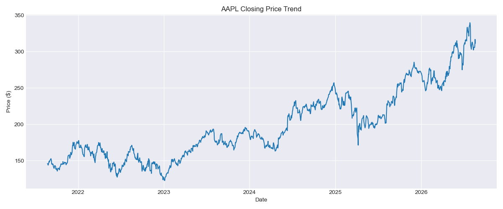
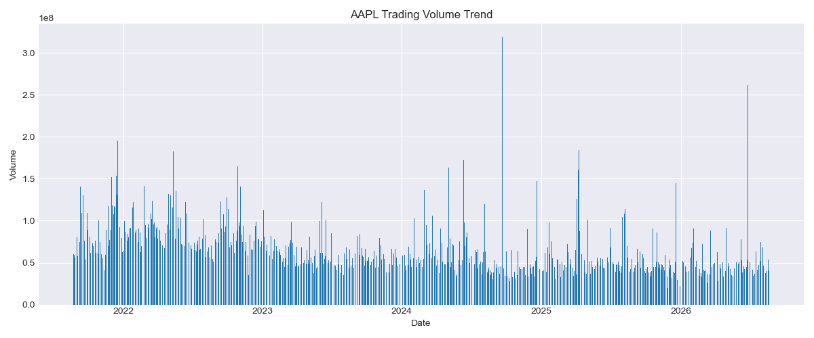
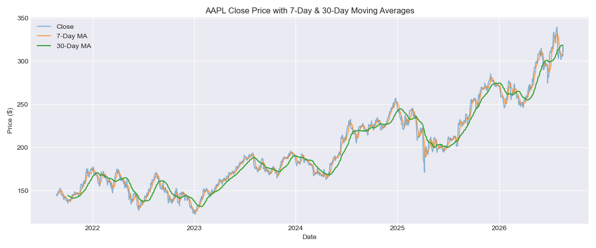
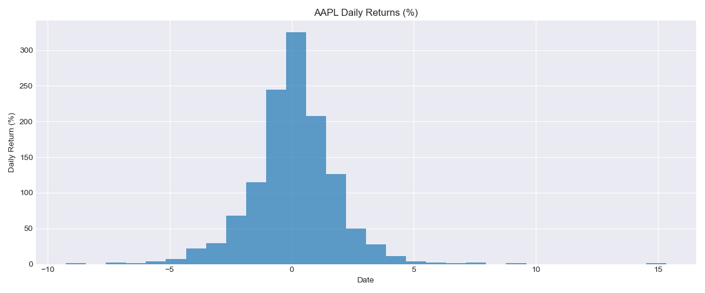
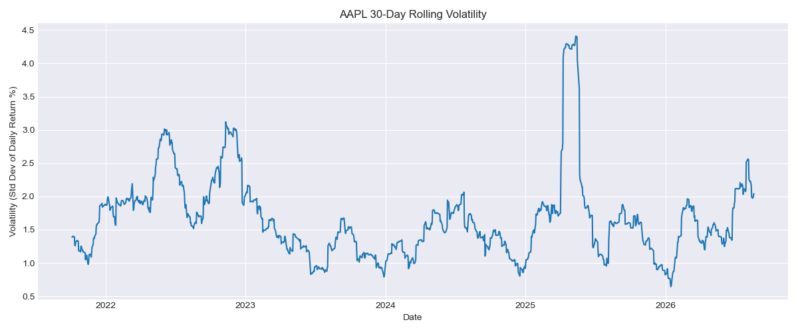
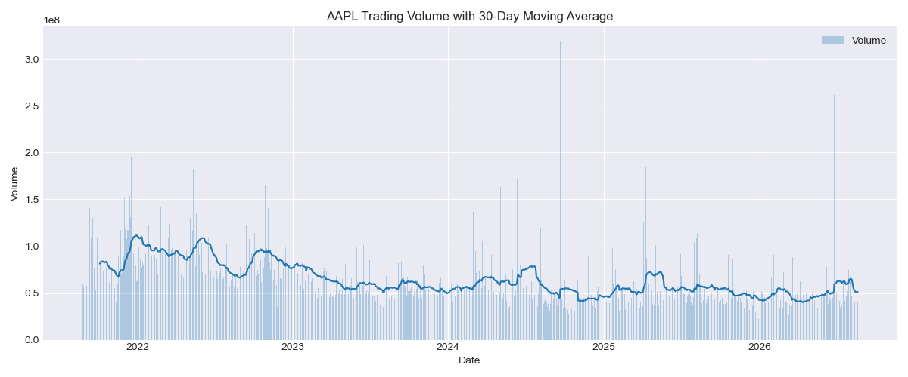

# Week 6: AAPL Stock Market Time-Series Analysis

**Dataset:** Apple Inc. (AAPL) Historical Stock Market Data
**Source:** Yahoo Finance, via the `yfinance` Python API ([finance.yahoo.com/quote/AAPL/history](https://finance.yahoo.com/quote/AAPL/history/))
**Size:** ~5 years of daily trading data (mid-2021 to August 2026)
**Tools Used:** Python, Pandas, NumPy, Matplotlib, yfinance

---

## 🎯 Objective

Clean and explore ~5 years of AAPL daily stock data to uncover pricing trends, momentum signals, and volatility patterns using Pandas-based data transformation and time-series analysis.

---

## 📊 Dataset Understanding

**Column types:**

| Column | Type | Description |
|---|---|---|
| Date (index) | datetime64 | Trading day |
| Open, High, Low, Close | float64 | Daily price points |
| Volume | int64 | Shares traded |
| Year, Month | int64 | Extracted from the date index |
| Price_Change | float64 | Absolute day-over-day price change |
| Daily_Return_% | float64 | Percentage day-over-day price change |
| MA_7, MA_30 | float64 | 7-day and 30-day rolling moving averages |
| Volatility_30 | float64 | 30-day rolling standard deviation of returns |
| Cumulative Return | float64 | Compounded return over the full period |
| Volume_MA_30 | float64 | 30-day rolling average of trading volume |

**Unique identifier confirmed:** the Date index. Checked with `df.index.duplicated().sum()`, which returned `0`, confirming one row per trading day.

---

## 🧹 Cleaning Summary

| Issue Found | Action Taken |
|---|---|
| yfinance returned a multi-level (MultiIndex) column structure | Flattened to single-level columns using `df.columns.get_level_values(0)` |
| Needed to confirm the date index was in proper chronological order | Sorted with `df.sort_index(ascending=True)` |
| Possible duplicate date entries in the index | Checked with `df.index.duplicated().sum()`; confirmed 0 duplicates |
| Missing values across OHLCV columns | Checked with `df.isnull().sum()`; dataset came back clean |
| Needed a Year/Month breakdown for monthly aggregation | Extracted `Year` and `Month` from the datetime index |
| Monthly figures weren't aligned to daily records | Resampled Close price to monthly frequency (`resample('ME')`) before calculating monthly returns |

---

## 🔍 Key EDA Findings

- AAPL's closing price rose from **$144.54 to $316.83** over the ~5-year window, a gain of roughly **119%**.
- Daily returns had a standard deviation of **~1.77%**, a moderate volatility level for a large-cap stock.
- 30-day rolling volatility spiked to nearly **4%** around 2025, the most turbulent stretch in the dataset versus a typical 1–2% range.
- The 7-day and 30-day moving averages showed clear crossover points that lined up with the start of each rally and pullback phase.
- Trading volume stayed largely range-bound over the period, punctuated by periodic sharp spikes rather than any steady long-term trend.

---

## 📈 Visualizations


AAPL's closing price nearly doubled over the period, climbing from $144.54 to $316.83 through multiple consolidation phases.


Volume stayed range-bound with no clear long-term direction, showing occasional sharp spikes likely tied to earnings or news events.


The 7-day and 30-day moving averages track the underlying trend closely, with crossovers marking the start of each rally and pullback.


Daily returns cluster tightly around 0%, consistent with typical single-stock behavior and only a handful of larger outlier days.


Volatility mostly held in a 1–2% band but spiked to almost 4% around 2025, flagging that period as unusually turbulent.


Smoothing raw volume with a 30-day average makes the underlying activity level easier to read against the daily spikes.

*(Filenames above assume `plt.savefig("visuals/<name>.png")` is called before `plt.show()` in each cell — rename to match whatever you actually saved.)*

---

## 💡 Top Insights

1. **Strong long-term uptrend** — AAPL grew roughly 119% over the 5-year window, confirming a solid overall growth trajectory despite short-term dips (see Closing Price Trend chart).
2. **Moving average crossovers as momentum signals** — MA_7/MA_30 crossovers lined up closely with the start of major rallies and pullbacks, making them a useful trend-following indicator (see Moving Average chart).
3. **2025 stands out as the most volatile period** — rolling volatility nearly doubled its typical range, spiking to ~4% (see Volatility chart).
4. **Returns are tightly clustered, not wildly erratic** — the bulk of daily moves sit close to 0%, with only occasional larger swings (see Daily Returns chart).
5. **Volume spikes don't follow price direction** — trading activity surged periodically without a consistent long-term trend, suggesting these spikes are event-driven rather than trend-driven (see Volume charts).

---

## 📁 Files in This Folder

- `AAPL_TimeSeries_Analysis.ipynb` — main analysis notebook
- `AAPL_Insight_Summary.docx` — 1–2 page insight summary report
- `visuals/` — folder containing all chart PNGs
- `README.md` — this file

---

## ▶️ How to Run

```bash
pip install pandas numpy matplotlib yfinance
jupyter notebook
```

Open `AAPL_TimeSeries_Analysis.ipynb` and run all cells from top to bottom.
