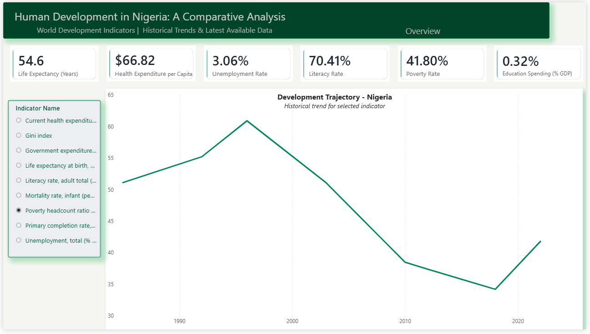
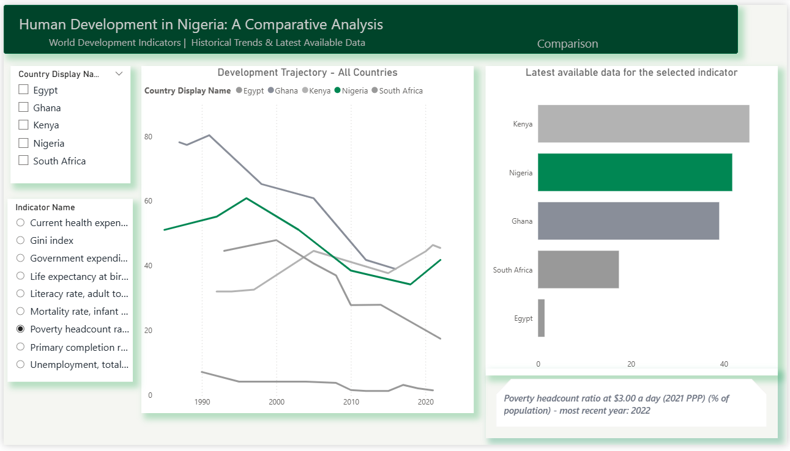
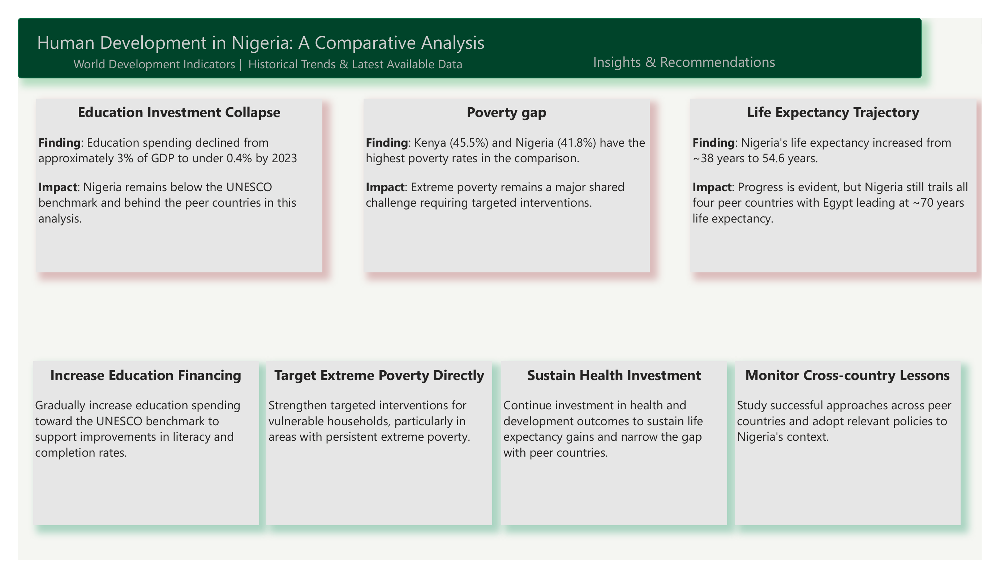

# Human Development in Nigeria: A Comparative Analysis

An end-to-end data analytics project comparing Nigeria's progress in education, health, and poverty against four peer African economies, using the World Bank's World Development Indicators (WDI) dataset.

**AnalystLab Africa** | Data Analytics Internship | Week 8 Capstone Project
**Author:** Tobiloba Osikoya ([LinkedIn](https://linkedin.com/in/tobiloba-osikoya-692085222) · [GitHub](https://github.com/Toby-OT))

---

## Objective

How does Nigeria's progress in human development compare to similar African economies, and where are the most significant gaps?

This project applies a complete analytics workflow, data acquisition, cleaning, modeling, analysis, and visualization, to answer that question for Nigeria against Ghana, Kenya, South Africa, and Egypt, across three themes: education, health, and poverty/labor.

## Dataset

- **Source:** [World Bank World Development Indicators (WDI)](https://datatopics.worldbank.org/world-development-indicators/)
- **Countries:** Nigeria (focus), Ghana, Kenya, South Africa, Egypt
- **Time range:** 1960 to 2024
- **Indicators used:**

| Theme | Indicator | WDI Code |
|---|---|---|
| Education | Adult literacy rate (% ages 15+) | SE.ADT.LITR.ZS |
| Education | Primary completion rate (%) | SE.PRM.CMPT.ZS |
| Education | Government expenditure on education (% of GDP) | SE.XPD.TOTL.GD.ZS |
| Health | Life expectancy at birth (years) | SP.DYN.LE00.IN |
| Health | Infant mortality rate (per 1,000 live births) | SP.DYN.IMRT.IN |
| Health | Current health expenditure per capita (current US$) | SH.XPD.CHEX.PC.CD |
| Poverty / Labor | Poverty headcount ratio at $3.00/day (2021 PPP, %) | SI.POV.DDAY |
| Poverty / Labor | Gini index | SI.POV.GINI |
| Poverty / Labor | Unemployment, total (% of labor force, ILO modeled) | SL.UEM.TOTL.ZS |

> **Note:** The World Bank rebased its PPP methodology in 2025, moving the extreme poverty line from $2.15/day (2017 PPP) to $3.00/day (2021 PPP). This project uses the updated $3.00/day figures throughout.

## Tools & Technologies

- **Excel** — initial filtering of the raw WDI dataset
- **Power Query (Power BI)** — unpivoting, data type correction, missing value handling
- **Power BI Desktop** — data modeling (star schema), DAX measures, dashboard design
- **DAX** — dynamic and fixed KPI measures

## Data Cleaning Process

1. Filtered the raw `WDIData.csv` (200+ countries, ~1,500 indicators, wide format) down to 5 countries and 9 indicators in Excel, reducing it to 45 rows.
2. Unpivoted the data in Power Query from wide format (one column per year) into long format (Country, Indicator, Year, Value).
3. Corrected data types: Year as Whole Number, Value as Decimal Number.
4. Converted placeholder zero values (representing missing survey data) to null, then removed empty rows, reducing the dataset from ~2,700 possible rows to 1,298 rows of genuine reported data.
5. Built a country dimension table (`WDICountry.csv`) with Country Code, Short Name, Region, and Income Group, filtered to the same 5 countries.
6. Established a many-to-one relationship between the indicator fact table and the country dimension table, forming a simple star schema.

## Analysis Approach

Rather than relying on simple visual-level aggregation, this project uses two categories of DAX measures:

- **Fixed KPI measures** — one per headline indicator, isolating that indicator and returning its value for the latest year with reported data.
- **Dynamic comparison measure** — a single measure using `SELECTEDVALUE()` to read whichever indicator is currently selected in a slicer, powering one reusable trend chart and one reusable comparison chart across all 9 indicators.

## Dashboard

A 3-page interactive Power BI dashboard:

### Overview
Nigeria-focused KPIs and a historical trend chart, switchable across all 9 indicators via a slicer.



### Comparison
All 5 countries compared side by side, with a trend chart (Nigeria highlighted in green, peers in gray) and a latest-year ranked bar chart.



### Insights & Recommendations
Written findings and recommendations derived from the analysis.



## Key Insights

1. **Education investment collapse** — Nigeria's government education expenditure declined from roughly 3% of GDP in the mid-1970s to under 0.4% by 2023, well below the UNESCO-recommended 4-6% benchmark and behind all four peer countries.
2. **Poverty gap** — Kenya (45.5%) and Nigeria (41.8%) have the highest poverty headcount ratios in the comparison, both far above South Africa (17.4%) and Egypt.
3. **Life expectancy trajectory** — Nigeria's life expectancy rose from ~38 years in 1960 to 54.6 years today, but still trails all four peer countries, with Egypt reaching ~70 years.

## Recommendations

1. Gradually increase public education investment toward the UNESCO benchmark.
2. Expand and improve the targeting of poverty-focused interventions.
3. Maintain and expand current levels of health expenditure.
4. Establish structured channels for comparing policy approaches across peer countries.

## Repository Structure

```
├── README.md
├── Nigeria_Human_Development_Capstone_Report.pdf   # Full written report
├── WDI_Dashboard.pbix                              # Power BI dashboard file
├── screenshots/
│   ├── overview.png
│   ├── comparison.png
│   └── insights-recommendations.png
└── data/                                           # Filtered dataset used in analysis
```

## Demo Video

[https://drive.google.com/file/d/1Rg8cWJtU2xX9iVeIYI2e68ruGk7pQGeP/view?usp=drivesdk]

## Deliverables Checklist

- [x] Final Report (PDF)
- [x] Power BI Dashboard (.pbix + screenshots)
- [x] GitHub Repository
- [x] Demo Video (5-10 minutes)
- [x] LinkedIn Post (tagging AnalystLab Africa, #AnalystLabAfrica)

---

*This project was completed as the Week 8 Capstone Project for the AnalystLab Africa Data Analytics Internship.*
